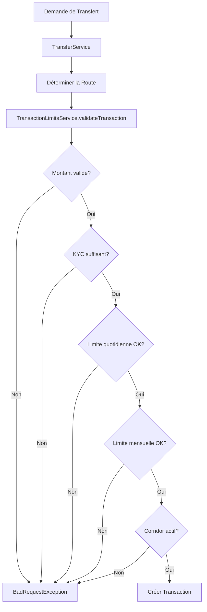

# Système de Limites de Transaction MbotamaPay

## Vue d'ensemble

Pour assurer la sécurité et la conformité réglementaire, MbotamaPay applique des plafonds de transaction intelligents à plusieurs niveaux. Ce document explique le fonctionnement du système de limites.

## Types de Limites

### 1. Limites par Transaction

Ces limites s'appliquent à chaque transaction individuelle :

- **Montant minimum** : 500 FCFA
- **Montant maximum standard** : 100 000 FCFA (corridors standard)
- **Montant maximum premium** : 200 000 FCFA (corridors premium)
- **Montant maximum absolu** : 200 000 FCFA (JAMAIS dépassé, réglementation)

### 2. Limites Quotidiennes (par utilisateur)

Les limites quotidiennes dépendent du niveau de vérification KYC :

| Niveau KYC | Limite Quotidienne | Description |
|------------|-------------------|-------------|
| **Niveau 0** (Non vérifié) | 0 FCFA | Transactions bloquées - KYC requis |
| **Niveau 1** (Vérifié) | 300 000 FCFA | Vérification basique complétée |
| **Niveau 2** (Vérifié Complet) | 500 000 FCFA | Vérification complète avec documents |

**Remarque** : Les limites quotidiennes sont réinitialisées à minuit (00:00:00) chaque jour.

### 3. Limites Mensuelles (par utilisateur)

- **Niveau 1** : 500 000 FCFA sur une période glissante de 30 jours
- **Niveau 2** : Illimité

### 4. Limites par Corridor

Chaque corridor de paiement (pays source → pays destination) a ses propres limites :

#### Corridors Locaux (pays → même pays)

| Corridor | Limite Quotidienne | Max par Transaction | Max Transactions/Jour |
|----------|-------------------|---------------------|----------------------|
| SN-SN | 2 000 000 FCFA | 200 000 FCFA | 100 |
| CI-CI | 2 000 000 FCFA | 200 000 FCFA | 100 |
| ML-ML | 1 500 000 FCFA | 150 000 FCFA | 75 |
| BF-BF | 1 500 000 FCFA | 150 000 FCFA | 75 |

#### Corridors Internationaux

| Corridor | Limite Quotidienne | Max par Transaction | Passerelle Préférée |
|----------|-------------------|---------------------|---------------------|
| SN-CI | 1 500 000 FCFA | 150 000 FCFA | Orange Money |
| SN-ML | 1 000 000 FCFA | 100 000 FCFA | Orange Money |
| SN-BF | 1 000 000 FCFA | 100 000 FCFA | Orange Money |
| CI-SN | 1 500 000 FCFA | 150 000 FCFA | Wave |

**Codes de pays** :
- SN = Sénégal
- CI = Côte d'Ivoire
- ML = Mali
- BF = Burkina Faso

## Ordre de Validation

Lors d'une tentative de transaction, les validations sont effectuées dans cet ordre :

1. **Vérification du montant minimum et maximum**
   - Montant ≥ 500 FCFA
   - Montant ≤ 200 000 FCFA

2. **Vérification du niveau KYC**
   - KYC doit être au moins au Niveau 1

3. **Vérification des limites quotidiennes**
   - Montant utilisé aujourd'hui + montant demandé ≤ limite quotidienne selon KYC

4. **Vérification des limites mensuelles**
   - Montant utilisé sur 30 jours + montant demandé ≤ limite mensuelle selon KYC

5. **Vérification des limites du corridor**
   - Le corridor doit être actif (`enabled: true`)
   - Montant ≤ limite maximale par transaction du corridor
   - Vérification de la limite quotidienne du corridor

## Modificateurs de Limites

Les limites peuvent être ajustées en fonction de plusieurs facteurs :

### Facteurs d'Augmentation
- ✅ **Niveau KYC supérieur** : Passez au niveau supérieur pour augmenter vos limites
- ✅ **Historique de transactions positif** : Bonne réputation
- ✅ **Disponibilité technique** : Partenaires fiables et disponibles

### Facteurs de Restriction
- ❌ **Exigences réglementaires** : Conformité obligatoire
- ❌ **Conditions du marché** : Volatilité ou risques
- ❌ **Problèmes techniques** : Passerelles indisponibles ou instables

## API Endpoints

### Obtenir les Limites Utilisateur

```http
GET /users/me/limits
Authorization: Bearer {token}
```

**Réponse** :
```json
{
  "success": true,
  "message": "Limites de transaction récupérées avec succès",
  "data": {
    "kycLevel": "LEVEL_1",
    "kycLevelDisplayName": "Vérifié Niveau 1",
    "kycDescription": "Limite de 500 000 FCFA/mois",
    "transactionLimits": {
      "minimum": 500,
      "maximumStandard": 100000,
      "absoluteMaximum": 200000
    },
    "dailyLimits": {
      "limit": 300000,
      "used": 50000,
      "remaining": 250000,
      "percentageUsed": 16.67
    },
    "monthlyLimits": {
      "limit": 500000,
      "used": 150000,
      "remaining": 350000,
      "percentageUsed": 30.0,
      "unlimited": false
    },
    "corridorLimits": [
      {
        "corridorCode": "SN-SN",
        "sourceCountry": "SN",
        "destinationCountry": "SN",
        "maxPerTransaction": 200000,
        "dailyLimit": 2000000,
        "maxTransactionsPerDay": 100,
        "preferredGateway": "WAVE",
        "gatewayReliability": 0.98,
        "enabled": true
      }
    ],
    "modifiers": {
      "upgradeConditions": [
        "Passez au KYC Niveau 2 pour augmenter votre limite quotidienne à 500 000 FCFA",
        "Limite mensuelle illimitée disponible au Niveau 2"
      ],
      "currentRestrictions": [
        "Limite quotidienne: 300 000 FCFA",
        "Limite mensuelle: 500 000 FCFA",
        "Montant maximum par transaction: 200 000 FCFA (réglementation)"
      ],
      "regulatoryInfo": "Ces limites sont appliquées pour assurer la sécurité et la conformité réglementaire..."
    }
  }
}
```

### Obtenir la Limite Simple (rétrocompatibilité)

```http
GET /users/me/transaction-limit
Authorization: Bearer {token}
```

## Configuration

Les limites sont configurées dans le fichier [application-limits.yml](src/main/resources/application-limits.yml).

### Modifier les Limites par Corridor

```yaml
limits:
  corridors:
    SN-SN:
      code: "SN-SN"
      daily-limit: 2000000          # 2M FCFA/jour
      max-per-transaction: 200000   # 200k FCFA/transaction
      max-transactions-per-day: 100
      preferred-gateway: "WAVE"
      gateway-reliability: 0.98
      enabled: true
```

### Modifier les Limites KYC

```yaml
limits:
  daily:
    level0: 0                       # KYC Niveau 0 : bloqué
    level1: 300000                  # KYC Niveau 1 : 300k/jour
    level2: 500000                  # KYC Niveau 2 : 500k/jour
```

## Messages d'Erreur

Le système retourne des messages d'erreur clairs en français :

- **Limite quotidienne dépassée** : "Limite quotidienne dépassée. Limite: 300 000 FCFA, Utilisé aujourd'hui: 250 000 FCFA, Disponible: 50 000 FCFA"
- **KYC requis** : "Vérification d'identité requise. Complétez votre KYC pour envoyer de l'argent."
- **Corridor indisponible** : "Ce corridor de paiement est temporairement indisponible. Veuillez réessayer ultérieurement."
- **Montant maximum** : "Montant maximum pour ce corridor: 150 000 FCFA. Veuillez réduire le montant."

## Architecture Technique

### Services Impliqués

1. **TransactionLimitsService** : Validation centralisée des limites
2. **TransferService** : Intégration dans le flux de transfert
3. **TransactionLimitsConfig** : Configuration des limites

### Flux de Validation



## Bonnes Pratiques

### Pour les Développeurs

1. **Toujours utiliser TransactionLimitsService** pour valider les transactions
2. **Ne jamais contourner** les validations de limites
3. **Logger les tentatives** de dépassement de limites pour analyse
4. **Tester les cas limites** : montant = limite exacte, 1 FCFA de trop, etc.

### Pour les Utilisateurs

1. **Vérifiez vos limites** avant d'initier une transaction importante
2. **Complétez votre KYC** pour augmenter vos limites
3. **Planifiez vos transferts** en fonction des limites quotidiennes
4. **Contactez le support** si vous avez besoin de limites spéciales

## Support et Contact

Pour toute question concernant les limites de transaction :
- 📧 Email : support@mbotamapay.com
- 📱 Téléphone : +221 XX XXX XXXX
- 💬 Chat : Disponible dans l'application

## Historique des Modifications

- **2025-12-25** : Mise en place du système complet de limites multi-niveaux
- Ajout des limites quotidiennes par niveau KYC
- Ajout des limites par corridor
- API `/users/me/limits` pour afficher toutes les limites
